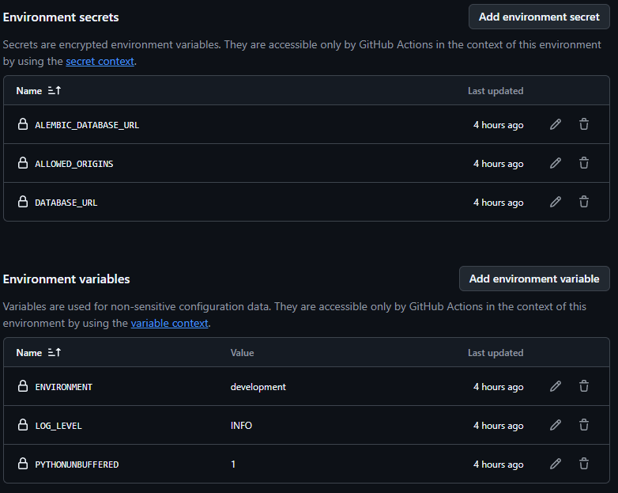

# DSO - отчет по практикам P06-P08
### Выполнил: Владимиров Алексей
### Группа: бпи235

# Тема проекта:
## Защищенная доска для голосований

# 1. Исправление ошибок и внедрение лучших практик в контейнерной безопасности

Так как проект использует все больше и больше новых сервисов для покрытия различных уязвимостей
критически важно что бы сборка контейнеров оставалась достаточно быстрой.

Были настроены:
- Настройка `root` прав для пользователей контейнера
- Сборка перенастроена на использование `wheel` пакетов
- В качестве базового образа `python:3.11` зафиксирован digest для предотвращения непредвиденных изменений при обновлении
- Миграции добавлены в качестве отдельно запускаемого контейнера в `docker-compose.yml`

### Файл `Dockerfile`

```dockerfile
# Build stage
FROM python:3.11-slim@sha256:158caf0e080e2cd74ef2879ed3c4e697792ee65251c8208b7afb56683c32ea6c AS build
WORKDIR /app

ENV PYTHONDONTWRITEBYTECODE=1

COPY requirements.txt ./
RUN pip wheel --no-cache-dir -r requirements.txt -w /wheels
COPY . .

ENV PYTHONPATH=/app

# Runtime stage
FROM python:3.11-slim@sha256:158caf0e080e2cd74ef2879ed3c4e697792ee65251c8208b7afb56683c32ea6c
WORKDIR /app

ENV PYTHONDONTWRITEBYTECODE=1
ENV PYTHONUNBUFFERED=1

RUN groupadd -r appgroup && useradd -r -g appgroup appuser

COPY --from=build /wheels /wheels

# copy requirements and install only from wheels; use buildkit cache for pip
COPY requirements.txt ./
RUN --mount=type=cache,target=/root/.cache/pip \
    pip install --no-cache-dir --no-index --find-links /wheels -r requirements.txt

COPY docker-entrypoint.sh /app/docker-entrypoint.sh
RUN chmod +x /app/docker-entrypoint.sh

COPY . .

# ensure correct ownership before switching user
RUN chown -R appuser:appgroup /app

EXPOSE 8000
HEALTHCHECK --interval=30s --timeout=3s --retries=3 --start-period=5s \
    CMD ["python", "-c", "import httpx; httpx.get('http://localhost:8000/health', timeout=2.0)"]

USER appuser

ENTRYPOINT ["/app/docker-entrypoint.sh"]
CMD ["uvicorn", "src.app.main:app", "--host", "0.0.0.0", "--port", "8000"]
```

### Файл `docker-compose.yml`

```yaml
services:
  db:
    image: postgres:17
    restart: always
    env_file: .env
    volumes:
      - pgdata:/var/lib/postgresql/data
    healthcheck:
      test: ["CMD-SHELL", "pg_isready -U postgres"]
      interval: 5s
      timeout: 5s
      retries: 5
    networks:
      - backend

  migrations:
    image: sec-vote-board:dev
    env_file: .env
    command: ["alembic", "upgrade", "head"]
    depends_on:
      db:
        condition: service_healthy
    networks:
      - backend

  app:
    build: .
    image: sec-vote-board:dev
    ports:
      - "8080:8000"
    env_file: .env
    depends_on:
      db:
        condition: service_healthy
      migrations:
        condition: service_completed_successfully
    security_opt:
      - no-new-privileges:true
    cap_drop:
      - ALL
    cap_add:
      - NET_BIND_SERVICE
    read_only: true
    tmpfs:
      - /tmp:rw,size=64m
      - /app/__pycache__:rw,size=16m
    deploy:
      resources:
        limits:
          cpus: '0.50'
          memory: 1024M
    networks:
      - backend

volumes:
  pgdata:

networks:
  backend:
    driver: bridge
```

# 2. Настройка CI пайплайна для автоматического сканирования уязвимостей

Была значительно расширено покрытие CI пайплайна для автоматического сканирования уязвимостей
Добавлены:
- Управление секретами через `GitHub Secrets`
- Управление переменными окружения через `GitHub Secrets`
- Добавлена проверка образов контейнеров и анализ уязвимости через `Trivy`
- Добавлена проверка докер-файлов через `Hadolint`
- Добавлена матрица тестирования на операционных системах `Ubuntu` и `Windows` а так же на разных версиях `python`
- Настроен сбор артефактов и отчетов в CI пайплайне
- Настроено кэширование `pip`
- Линтеры с предыдущих практик интегрированы в общий CI пайплайн, а тесты полностью переведены в контур CI

### Хранимые секреты:


### CI пайплайн

```yaml
name: CI
on:
  pull_request:
  push:
    branches: [main]

permissions:
  contents: read

concurrency:
  group: ${{ github.workflow }}-${{ github.ref }}
  cancel-in-progress: true

jobs:
  container-lint:
    runs-on: ubuntu-latest
    steps:
      - uses: actions/checkout@v4

      - name: Run hadolint
        uses: hadolint/hadolint-action@v3.1.0
        with:
          dockerfile: Dockerfile
          config: .hadolint.yaml
          format: json
          output-file: hadolint-report.json
          no-fail: false

      - name: Upload hadolint report
        uses: actions/upload-artifact@v4
        if: always()
        with:
          name: hadolint-report
          path: hadolint-report.json
          retention-days: 30

  container-scan:
    runs-on: ubuntu-latest
    steps:
      - uses: actions/checkout@v4

      - name: Set up Docker Buildx
        uses: docker/setup-buildx-action@v3

      - name: Build image
        uses: docker/build-push-action@v5
        with:
          context: .
          file: ./Dockerfile
          tags: sec-vote-board:ci
          load: true
          cache-from: type=gha
          cache-to: type=gha,mode=max

      - name: Trivy vulnerability scanner
        uses: aquasecurity/trivy-action@master
        with:
          image-ref: sec-vote-board:ci
          format: json
          output: trivy-report.json
          severity: HIGH,CRITICAL
          trivyignores: .trivyignore

      - name: Upload Trivy report
        uses: actions/upload-artifact@v4
        if: always()
        with:
          name: trivy-report
          path: trivy-report.json
          retention-days: 30

  root-user-check:
    runs-on: ubuntu-latest
    environment: testing
    env:
      DATABASE_URL: ${{ secrets.DATABASE_URL }}
      ALEMBIC_DATABASE_URL: ${{ secrets.ALEMBIC_DATABASE_URL }}
    defaults:
      run:
        working-directory: tests
    steps:
      - uses: actions/checkout@v4

      - name: Set up Docker Buildx
        uses: docker/setup-buildx-action@v3

      - name: Build image with cache
        uses: docker/build-push-action@v5
        with:
          context: .
          file: ./Dockerfile
          tags: sec-vote-board:dev
          load: true
          cache-from: type=gha
          cache-to: type=gha,mode=max

      - name: Run non-root Docker check
        run: |
          bash test_non_root_docker.sh sec-vote-board:dev

  build:
    runs-on: ${{ matrix.os }}
    environment: testing
    strategy:
      fail-fast: false
      matrix:
        os: [ubuntu-latest, windows-latest]
        python-version: ["3.9", "3.11", "3.12"]
    name: Test (Python ${{ matrix.python-version }}, ${{ matrix.os }})
    env:
      DATABASE_URL: ${{ secrets.DATABASE_URL }}
      ALEMBIC_DATABASE_URL: ${{ secrets.ALEMBIC_DATABASE_URL }}
      ALLOWED_ORIGINS: ${{ secrets.ALLOWED_ORIGINS }}
    steps:
      - uses: actions/checkout@v4

      - uses: actions/setup-python@v5
        with:
          python-version: ${{ matrix.python-version }}

      - name: Cache pip packages
        uses: actions/cache@v4
        with:
          path: |
            ~/.cache/pip
            ~\AppData\Local\pip\Cache
          key: ${{ runner.os }}-pip-${{ matrix.python-version }}-${{ hashFiles('requirements.txt', 'requirements-dev.txt', 'pyproject.toml') }}
          restore-keys: |
            ${{ runner.os }}-pip-${{ matrix.python-version }}-
            ${{ runner.os }}-pip-

      - name: Cache pre-commit environments
        uses: actions/cache@v4
        with:
          path: ~/.cache/pre-commit
          key: ${{ runner.os }}-pre-commit-${{ matrix.python-version }}-${{ hashFiles('.pre-commit-config.yaml') }}
          restore-keys: |
            ${{ runner.os }}-pre-commit-${{ matrix.python-version }}-
            ${{ runner.os }}-pre-commit-

      - name: Mask sensitive values
        run: |
          echo "::add-mask::${{ secrets.DATABASE_URL }}"
          echo "::add-mask::${{ secrets.ALEMBIC_DATABASE_URL }}"
          echo "::add-mask::${{ secrets.ALLOWED_ORIGINS }}"

      - name: Install dependencies
        run: |
          python -m pip install --upgrade pip
          pip install -r requirements.txt -r requirements-dev.txt

      - name: Lint & Format
        run: |
          ruff check --output-format=github .
          black --check .
          isort --check-only .

      - name: Tests with coverage
        run: |
          pytest --cov=src --cov-report=html --cov-report=json --cov-report=xml --html=pytest_report.html --self-contained-html

      - name: Upload coverage HTML
        uses: actions/upload-artifact@v4
        if: always()
        with:
          name: coverage-html-${{ matrix.os }}-py${{ matrix.python-version }}
          path: coverage_html/
          retention-days: 30

      - name: Upload coverage JSON
        uses: actions/upload-artifact@v4
        if: always()
        with:
          name: coverage-json-${{ matrix.os }}-py${{ matrix.python-version }}
          path: coverage.json
          retention-days: 30

      - name: Upload coverage XML (for Codecov)
        uses: actions/upload-artifact@v4
        if: always()
        with:
          name: coverage-xml-${{ matrix.os }}-py${{ matrix.python-version }}
          path: coverage.xml
          retention-days: 30

      - name: Upload pytest HTML report
        uses: actions/upload-artifact@v4
        if: always()
        with:
          name: pytest-report-${{ matrix.os }}-py${{ matrix.python-version }}
          path: pytest_report.html
          retention-days: 30

      - name: Pre-commit (all files)
        run: pre-commit run --all-files

      - name: Build wheel
        if: matrix.os == 'ubuntu-latest' && matrix.python-version == '3.11'
        run: |
          python -m pip install build
          python -m build

      - name: Upload built package
        if: matrix.os == 'ubuntu-latest' && matrix.python-version == '3.11'
        uses: actions/upload-artifact@v4
        with:
          name: python-package-distributions
          path: dist/
          retention-days: 90

      - name: Display environment info (sanitized)
        if: always()
        run: |
          echo "Environment: ${{ vars.ENVIRONMENT }}"
          echo "Log Level: ${{ vars.LOG_LEVEL }}"
          echo "Python Version: ${{ matrix.python-version }}"
          echo "OS: ${{ matrix.os }}"
```

### 3. Заключение
В результате этих действий скорость сборки проекта уменьшилась, и составляет теперь
10 секунд вместо 37. Так же повысилась безопасность проекта в целом и в частности
его отдельных элементов таких как контейнеры и CI пайплайн, засчет интегрирования
чекеров безопасности и управления секретами.

Подобные решения отлично горизонтально масштабируются на добавление
как новой кодовой базы(новых сервисов и тд) так и новых инструментов сканирования(
`SAST`, `DAST` анализ и тд)
