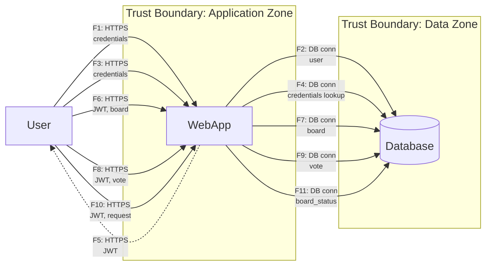

# DSO - отчет по практикам P01-P05
### Выполнил: Владимиров Алексей
### Группа: бпи235

# Тема проекта:
## Защищенная доска для голосований

# 1. Нефункциональные требования безопасности (NFR)

В ходе разработки приложения были выявлены следующие требования к безопасности к системе.

Эти требования можно отнести к классу нефункциональных требований, так как они определяют свойства и ограничения системы, не задающие ограничения в сфере функционала приложения.

Так же важно что у каждого требования прописан механизм измерения проекта на его соответствие.

Ниже эти требования перечисляются:

| ID     | Name                              | Description                                                   | Metrics                                               | Check (where/how)           | Component       | Priority |
|--------|-----------------------------------|---------------------------------------------------------------|-------------------------------------------------------|-----------------------------|-----------------|----------|
| NFR-01 | Password storage                  | Secure users password hashing via Argon2id                    | t=3, m=256MB, p=1                                     | Configuration files + tests | auth            | High     |
| NFR-02 | Correctness of board statuses     | Ensure users can't vote on closed boards                      | 100% of voting routes reject invalid status           | Unit tests                  | api/repo        | High     |
| NFR-03 | Voting response time              | p95 <= 150 ms @ 150 RPS on stage                              | p95 <= 150 ms @ 150 RPS                               | High load tests             | voting          | Medium   |
| NFR-04 | Login attempt threshold (p95/p99) | On login: <= 5 retries, after that 429 with 5 min cooldown    | 6th attempt returns 429; cooldown lasts in [5;10] min | Rate-limit metrics + logs   | auth            | Medium   |
| NFR-05 | Login response time               | p95 <= 500 ms at 150 RPS on stage                             | p95 <= 500 ms @ 150 RPS                               | High load tests             | auth            | Low      |
| NFR-06 | Block additional voting           | Block user from voting multiple times for the same idea       | 100% of voting routes reject repeated vote            | Unit tests                  | voting          | High     |
| NFR-07 | RFC7807 exception format adopting | Save corr_id; uniform JSON standard for errors (RFC7807)      | 100% of endpoints                                     | Contract testing            | errors          | Low      |
| NFR-08 | Personal data privacy             | User credentials and vote distribution are secured and masked | 100% of endpoints do not return personal data         | Unit tests                  | auth/api/voting | High     |

Стоит отметить, что по мере развития проекта этот список может обновляться и дополняться новыми требованиями.

# 2. Диаграмма потоков данных (DFD)

## Диаграмма

Всего в системе выделяется 3 принципиально разных зоны:
- Внешний интернет, то место откуда приходят клиенты
- Зона приложения, в которой происходит обработка внешних данных и собственно защита следующего слоя от вредоносного воздействия
- Зона данных, в которой располагаются данные(порой чувствительные)

## Примеры потоков данных:
- F10 (User → WebApp) -- Запрос на закрытие доски, уязвим к ошибочному закрытию не авторизированным пользователем или повторному закрытию доски
-  F3 (User → WebApp) -- Аутентификация пользователя, уязвима к перебору паролей или перехвату учетных данных

## STRIDE анализ угроз

| Поток/Элемент       | STRIDE (S/T/R/I/D/E)       | Описание угрозы                                                              | Контроль                                                                                         | Ссылка на NFR | Проверка/Артефакт                   |
|---------------------|----------------------------|------------------------------------------------------------------------------|--------------------------------------------------------------------------------------------------|---------------|-------------------------------------|
| F1: Регистрация     | S (Spoofing)               | Злоумышленник регистрирует аккаунт на чужую почту.                           | Подтверждение email через отправку уникальной ссылки.                                            | -             | `user_service.py`                   |
| F2: Запись в БД     | I (Information Disclosure) | Пароли пользователей хранятся в базе данных в нехэшированном виде.           | Хеширование паролей с использованием стойкого алгоритма (`Argon2id`).                            | NFR-01        | `user_service.py`                   |
| F2: Запись в БД     | T (Tampering)              | SQL-инъекция при создании пользователя, позволяющая изменить логику запроса. | Использование ORM (`SQLAlchemy`) с параметризацией запросов.                                     | -             | `user_repo.py`                      |
| F5: Выдача JWT      | I (Information Disclosure) | Токен содержит избыточную личную информацию (например, `name`).              | Включать в токен только необходимый минимум данных (например, `user_id`).                        | NFR-08        | `user_service.py`                   |
| F8: Голосование     | T (Tampering)              | Пользователь голосует несколько раз за одну и ту же идею.                    | Проверка в БД, что пользователь ещё не голосовал за эту идею (уникальность пары `user_id+idea`). | NFR-06        | `vote_service.py`, `test_votes.py`  |
| F8: Голосование     | E (Elevation of Privilege) | Пользователь голосует на доске, которая уже закрыта.                         | Проверка статуса доски (`board.status`) перед принятием голоса.                                  | NFR-02        | `vote_service.py`, `test_boards.py` |
| F10: Закрытие доски | E (Elevation of Privilege) | Не владелец / администратор пытается закрыть доску.                          | Проверка, что `user_id` из JWT совпадает с `board.owner_id`.                                     | NFR-02        | `board_service.py`                  |
| WebApp              | I (Information Disclosure) | В сообщениях об ошибках раскрывается внутренняя структура кода или данные.   | Обработчики исключений: стандартизированный формат ошибок (RFC7807).                             | NFR-07        | `main.py` (exception handlers)      |

# 3. Приоритеты рисков

Ниже приведена полная таблица рисков, составленная на основе модели угроз и нефункциональных требований безопасности. Здесь она приведена в отсортированном виде:

| RiskID | Описание                                                                              | Связь (F/NFR)  | L | I | Risk | Стратегия (принять/снизить/избежать/перенести) | Владелец     | Срок       | Критерий закрытия                                                                                                                          |
|--------|---------------------------------------------------------------------------------------|----------------|---|---|------|------------------------------------------------|--------------|------------|--------------------------------------------------------------------------------------------------------------------------------------------|
| R-02   | Накрутка голосов из-за возможности многократного голосования одним пользователем      | F8, NFR-06     | 4 | 4 | 16   | Избежать                                       | Backend Team | 2025-10-09 | В БД обеспечена уникальность `(user_id, idea_id)` (уникальный индекс/constraint); негативные тесты на повторный голос (`test_votes.py`).   |
| R-05   | Атака перебором паролей на эндпоинт аутентификации                                    | F3, NFR-04     | 4 | 4 | 16   | Снизить                                        | Backend Team | 2026-01-20 | Rate limiting на логин: ≤5 неуспешных попыток, затем 429 и cooldown 5 минут; тесты/метрика 429 в логах/мониторинге.                        |
| R-01   | Компрометация учетных данных из-за хранения паролей в открытом виде                   | F2, NFR-01     | 3 | 5 | 15   | Снизить                                        | Backend Team | 2025-11-15 | Пароли хэшируются Argon2id (t=3, m=256MB, p=1); есть unit-тест(ы), проверяющие, что в БД не сохраняется исходный пароль (`test_users.py`). |
| R-04   | Перехват учетных данных при передаче по незащищенному каналу                          | F1, F3, NFR-08 | 3 | 5 | 15   | Снизить                                        | DevOps Team  | 2026-02-01 | В production включён HTTPS; HTTPS redirect.                                                                                                |
| R-06   | Голосование на закрытой доске из-за отсутствия проверки статуса голосования           | F8, NFR-02     | 3 | 4 | 12   | Избежать                                       | Backend Team | 2025-10-09 | Проверка `board.status` перед голосованием; есть негативные тесты (`test_votes.py`).                                                       |
| R-03   | Несанкционированное изменение статуса доски обычным пользователем                     | F10, NFR-02    | 2 | 5 | 10   | Снизить                                        | Backend Team | 2025-12-08 | Проверка владельца/прав перед изменением статуса (`board.owner_id`).                                                                       |
| R-08   | Подделка или изменение JWT-токена для получения доступа от имени другого пользователя | F5, NFR-08     | 2 | 5 | 10   | Снизить                                        | Backend Team | 2026-01-01 | JWT подписывается надёжным секретом; токен содержит минимум необходимой информации; подпись валидируется на каждом запросе.                |
| R-07   | Утечка внутренней информации через сообщения об ошибках                               | WebApp, NFR-07 | 3 | 3 | 9    | Снизить                                        | Backend Team | 2025-10-28 | Единый формат ошибок RFC7807; в production не возвращаются чувствительные данные; контрактные тесты/проверка ответов.                      |

Тут так же указывается какие меры, стоит предпринять командам разрабатывающим проект, что бы снизить или избежать риски.

На текущий момент покрыты риски `R04, R05, R07`. Они покрываются следующими мерами:
- ADR-001: Унификация ошибок согласно стандарту RFC 7807
- ADR-002: Security Headers и CORS
- ADR-003: Rate Limiting и Request Timeout для входящих запросов

# 4. Operational часть

На данный момент в проекте реализовано 2 сервиса согласно указанным потокам данных. Их синхронизация работает через инструменты `Docker Compose`.

В качестве сервиса хранилища данных была выбрана СУБД `PostgreSQL`, которая развёрнута в отдельном контейнере. Для облегчения взаимодействия, и заключения доменных контрактов используются фреймворки `Alembic` и `SQLAlchemy ORM`.

Архитектура приложения строится на базе принципов чистой архитектуры (Clean Architecture) и DDD.
