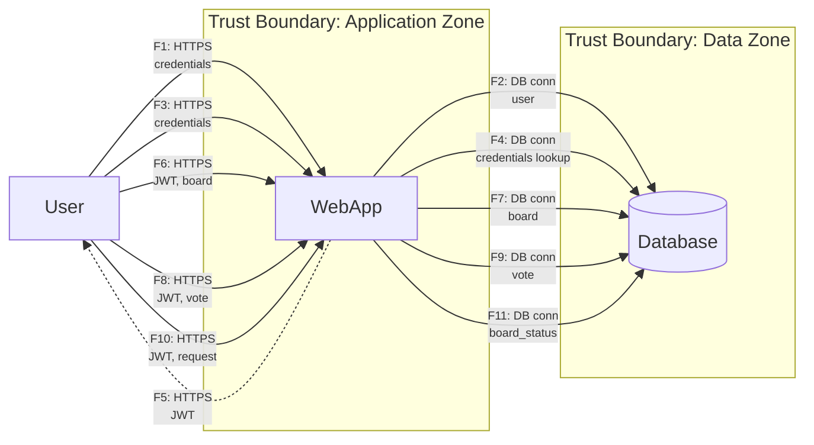

# DFD — Data Flow Diagram

## Список потоков данных

| ID  | Откуда → Куда     | Канал/протокол                 | Данные/PII         | Комментарий                   |
|-----|-------------------|--------------------------------|--------------------|-------------------------------|
| F1  | User → WebApp     | HTTPS                          | credentials        | Регистрация пользователя      |
| F2  | WebApp → Database | Соединение с БД (драйвер/SSL*) | user               | Создание пользователя в БД    |
| F3  | User → WebApp     | HTTPS                          | credentials        | Аутентификация пользователя   |
| F4  | WebApp → Database | Соединение с БД (драйвер/SSL*) | credentials lookup | Проверка учетных данных в БД  |
| F5  | WebApp → User     | HTTPS                          | JWT                | Возврат JWT-токена            |
| F6  | User → WebApp     | HTTPS (Bearer JWT)             | JWT, board         | Создание доски                |
| F7  | WebApp → Database | Соединение с БД (драйвер/SSL*) | board              | Запись доски в БД             |
| F8  | User → WebApp     | HTTPS (Bearer JWT)             | JWT, vote          | Голосование за идею           |
| F9  | WebApp → Database | Соединение с БД (драйвер/SSL*) | vote               | Запись голоса в БД            |
| F10 | User → WebApp     | HTTPS (Bearer JWT)             | JWT, request       | Запрос на закрытие доски      |
| F11 | WebApp → Database | Соединение с БД (драйвер/SSL*) | board_status       | Обновление статуса доски в БД |
